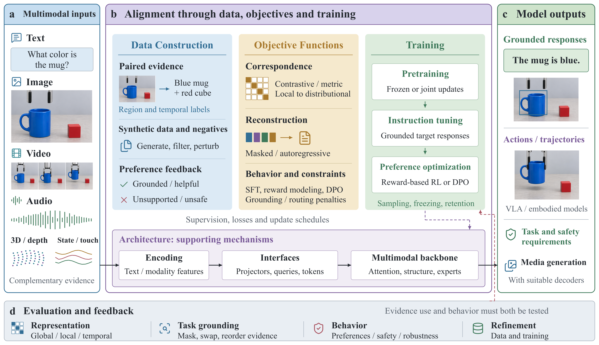
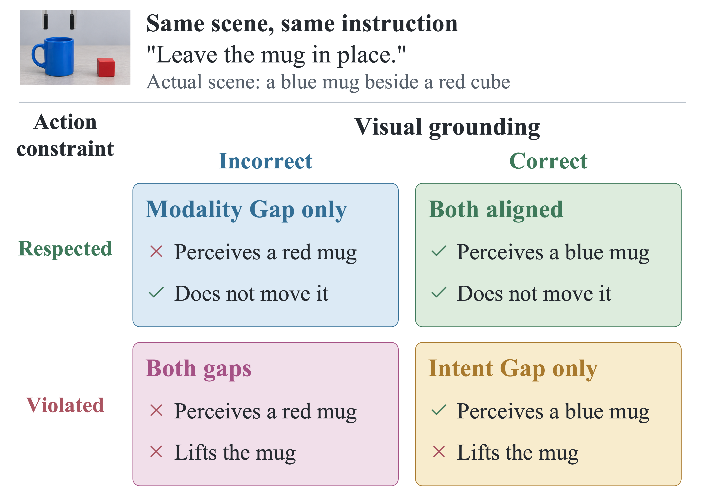
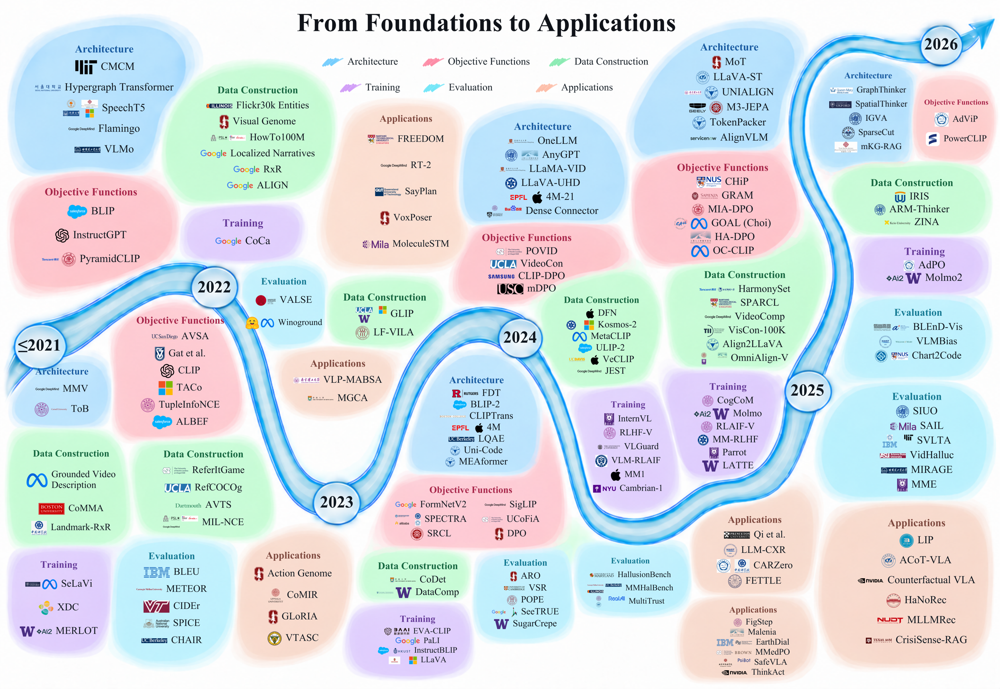

# Alignment in Multimodal Large Language Models

**A survey companion on mechanisms, supervision, and evidence.**

[Paper catalog](catalog/README.md) · [Supplement PDF](supplement/supplement.pdf) · [Figures](figures/README.md) · [Timeline sources](figures/timeline/README.md) · [Citation history](catalog/history/README.md)

This repository accompanies *Alignment in Multimodal Large Language Models: A Survey*, being prepared for TPAMI submission. It connects what methods optimize, where their supervision comes from, how they are trained, and what evidence supports their alignment claims.

**275 body-cited papers | 6 research domains | 3 manuscript figures | 163 timeline entries**

Manuscript snapshot: **26 September 2026**. This is a private working companion, not an accepted publication or an IEEE-endorsed resource.

## Contents

- [Overview](#overview)
- [Alignment: What, Why, and How](#alignment-what-why-and-how)
- [Browse by Domain](#browse-by-domain)
- [Timeline and Editable Sources](#timeline-and-editable-sources)
- [Supplementary Comparisons](#supplementary-comparisons)
- [Downloads and Citation History](#downloads-and-citation-history)
- [Scope and Inclusion](#scope-and-inclusion)
- [Contribute and Reproduce](#contribute-and-reproduce)

## Overview



*Figure 1. Data provides supervision, objectives specify optimization targets, and training controls updates. Architecture enables multimodal information flow; evaluation tests evidence use and behavior and informs refinement.*

## Alignment: What, Why, and How

**What is alignment?** Multimodal alignment is the consistency of a model's representations and observable behavior with **input evidence, task requirements, and human expectations**. Connecting images, language, audio, and actions requires more than similar embeddings: the model must use the right evidence to support the right claim or decision.

**Why is it needed?** Fluent output can still hallucinate objects, misorder events, ignore a modality, or violate a task constraint. In medical, robotic, and climate-support settings, these failures also undermine traceability and downstream decisions. Benchmark accuracy and polished language alone do not establish reliable evidence use.

**How is it pursued?** Architectural interfaces control information access; data and objectives define learning signals; training determines the update process. Evaluation then tests representations, task grounding, and behavior, including responses to controlled changes in the evidence.

The survey uses two complementary diagnostic perspectives:

| Perspective | Diagnostic question | Scope |
| --- | --- | --- |
| **Modality Gap** | Does the model establish and use the correspondence needed across modalities? | Object binding, temporal correspondence, and evidence-dependent responses; broader than geometric separation between modality embeddings. |
| **Intent Gap** | Does behavior satisfy the stated goal and constraints? | Task compliance, safety requirements, and justified certainty. |

These perspectives are not an exhaustive partition of errors. Correct perception followed by faulty reasoning requires further diagnosis; it should not automatically be assigned to either gap.

<p align="center"></p>

*Figure 2. Perceptual correctness and action compliance are assessed separately for the same scene and instruction. Passing these checks does not establish general model reliability.*

## Browse by Domain

**Two gaps diagnose problems; six domains organize interventions and assessment; three evaluation levels test the resulting claims.**

Domain pages group papers by publication year, newest first, and retain method names, source links, citation keys, and placement information. Foundational studies and related surveys are not relabeled as core MLLM methods.

| Domain | Central question | Cited in chapter | In timeline |
| --- | --- | ---: | ---: |
| [Architecture](catalog/domains/architecture.md) | What evidence can reach the language model? | 66 | 31 |
| [Objective Functions](catalog/domains/objective-functions.md) | What is optimized? | 35 | 27 |
| [Data Construction](catalog/domains/data-construction.md) | Where does supervision come from? | 110 | 32 |
| [Training](catalog/domains/training.md) | Which components are updated, and when? | 37 | 22 |
| [Evaluation](catalog/domains/evaluation.md) | What evidence supports an alignment claim? | 41 | 24 |
| [Applications](catalog/domains/applications.md) | Which constraints change across application settings? | 27 | 27 |

Chapter counts overlap. A work can be discussed for its loss in Objectives, its supervision in Data, and its update procedure in Training. Timeline membership is a separate visual assignment, not proof of discussion in that chapter. [Classification policy](catalog/classification-policy.md).

## Timeline and Editable Sources



*Figure 3. A timeline of 163 representative works across six domains. Colors identify organizing categories; placement depicts historical development, not a hierarchy or performance ranking. The earliest bucket includes work published before 2021.*

[PDF](figures/figure-3-timeline.pdf) · [16,000-pixel PNG](figures/figure-3-timeline-16000.png) · [Editable PPTX](figures/timeline/timeline.pptx) · [Layout, assets, and renderer](figures/timeline/README.md)

The river background is raster artwork; text and foreground elements remain individually editable in the PPTX. Institutional attribution and logo reuse permission are separate issues. See [rights and attribution](RIGHTS.md) before public release.

## Supplementary Comparisons

These tables compare assumptions and evidence, not leaderboard scores or new experimental results.

| Comparison | What it clarifies | Files |
| --- | --- | --- |
| Architectural interventions | Selection mechanisms, supervision assumptions, and appropriate controls | [Read](supplement/tables/architecture-comparison.md) · [CSV](supplement/tables/architecture-comparison.csv) |
| Operational diagnostic matrix | Evidence failures, constraint violations, and reasoning-capability errors | [Read](supplement/tables/diagnostic-matrix.md) · [CSV](supplement/tables/diagnostic-matrix.csv) |
| Related-survey coverage | Version-specific source locations supporting comparison with earlier reviews | [Read](supplement/tables/related-survey-coverage.md) · [CSV](supplement/tables/related-survey-coverage.csv) |

The [supplement directory](supplement/README.md) also contains the compiled PDF, LaTeX sources, and six active main-text table sources.

## Downloads and Citation History

| Resource | Contents | Access |
| --- | --- | --- |
| Current reading list | All 275 body-cited records, once per citation key | [Readable catalog](catalog/all-papers.md) |
| Structured catalog | Authors, venues, links, domain memberships, and exact manuscript locations | [CSV](catalog/papers.csv) · [JSON](catalog/papers.json) |
| Current bibliography | Citation records for the current manuscript | [BibTeX](bibliography/current.bib) |
| Historical ledger | Earlier citations and inactive bibliography entries, with explicit status | [History](catalog/history/README.md) · [Archive BibTeX](bibliography/archive.bib) |
| Source provenance | Snapshot commit, counts, checksums, and validation boundaries | [Provenance](PROVENANCE.md) · [Manifest](catalog/manifest.json) |

**Where did removed references go?** They are retained in the historical ledger, separately from the current 275. Historical keys with unresolved metadata and library-only candidates are labeled; they are not counted as additional verified papers.

## Scope and Inclusion

The catalog covers **all references cited in the current manuscript body**, including related surveys, foundational methods, methodological background, and adjacent applications. Inclusion is not a claim that every record is a core MLLM alignment method or that every source received a new full-text review during this export.

This is a **structured narrative survey**, not an exhaustive systematic review. The manuscript reports searches through August 2026, selective updates on 9 September 2026, and targeted verification during revision. GUI agents and generation-side alignment are not comprehensively surveyed. The catalog preserves cited publication years, which can differ from preprint dates and the nominal conference year.

## Contribute and Reproduce

See [CONTRIBUTING.md](CONTRIBUTING.md) for evidence requirements, citation-preserving corrections, and the distinction between current citations and proposed additions. Author details and a final manuscript citation will be added after confirmation; no publication license or institutional endorsement is implied.

```bash
python3 -m pip install -r requirements.txt
python3 scripts/validate_catalog.py

# Refresh the six domain pages from the structured catalog.
python3 scripts/render_catalog.py
python3 scripts/render_catalog.py --check

# Inspect counts without rendering dependencies.
python3 scripts/catalog_stats.py
```

Timeline rendering instructions, font requirements, and asset boundaries are in the [timeline source guide](figures/timeline/README.md).
